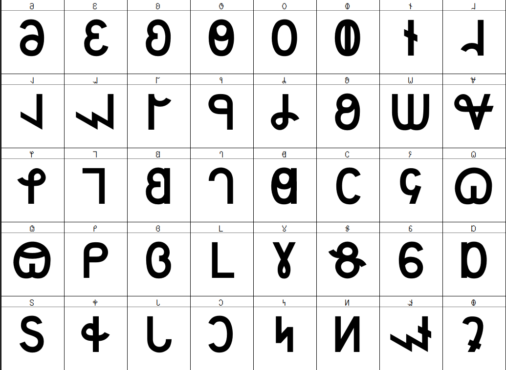

# IDC Nomada

A Deseret Alphabet font designed for compatibility with [USDOT Highway Gothic](https://en.wikipedia.org/wiki/Highway_Gothic) Series D.  For numerals, prefer the [Roadgeek fonts](https://github.com/sammdot/roadgeek-fonts), which are not available under a free license.

## Characters

The Deseret alphabet is encoded from U+10400–U+1044F in Unicode.  This font supplies the 40-letter Deseret Alphabet characters at the standard codepoints.

| Codepoint | Letter | Name |
| --- | --- | --- |
| U+10400 | 𐐀 | Deseret Capital Letter Long I |
| U+10401 | 𐐁 | Deseret Capital Letter Long E |
| U+10402 | 𐐂 | Deseret Capital Letter Long A |
| U+10403 | 𐐃 | Deseret Capital Letter Long Ah |
| U+10404 | 𐐄 | Deseret Capital Letter Long O |
| U+10405 | 𐐅 | Deseret Capital Letter Long Oo |
| U+10406 | 𐐆 | Deseret Capital Letter Short I |
| U+10407 | 𐐇 | Deseret Capital Letter Short E |
| U+10408 | 𐐈 | Deseret Capital Letter Short A |
| U+10409 | 𐐉 | Deseret Capital Letter Short Ah |
| U+1040A | 𐐊 | Deseret Capital Letter Short O |
| U+1040B | 𐐋 | Deseret Capital Letter Short Oo |
| U+1040C | 𐐌 | Deseret Capital Letter Ay |
| U+1040D | 𐐍 | Deseret Capital Letter Ow |
| U+1040E | 𐐎 | Deseret Capital Letter Wu |
| U+1040F | 𐐏 | Deseret Capital Letter Yee |
| U+10410 | 𐐐 | Deseret Capital Letter H |
| U+10411 | 𐐑 | Deseret Capital Letter Pee |
| U+10412 | 𐐒 | Deseret Capital Letter Bee |
| U+10413 | 𐐓 | Deseret Capital Letter Tee |
| U+10414 | 𐐔 | Deseret Capital Letter Dee |
| U+10415 | 𐐕 | Deseret Capital Letter Chee |
| U+10416 | 𐐖 | Deseret Capital Letter Jee |
| U+10417 | 𐐗 | Deseret Capital Letter Kay |
| U+10418 | 𐐘 | Deseret Capital Letter Gay |
| U+10419 | 𐐙 | Deseret Capital Letter Ef |
| U+1041A | 𐐚 | Deseret Capital Letter Vee |
| U+1041B | 𐐛 | Deseret Capital Letter Eth |
| U+1041C | 𐐜 | Deseret Capital Letter Thee |
| U+1041D | 𐐝 | Deseret Capital Letter Es |
| U+1041E | 𐐞 | Deseret Capital Letter Zee |
| U+1041F | 𐐟 | Deseret Capital Letter Esh |
| U+10420 | 𐐠 | Deseret Capital Letter Zhee |
| U+10421 | 𐐡 | Deseret Capital Letter Er |
| U+10422 | 𐐢 | Deseret Capital Letter El |
| U+10423 | 𐐣 | Deseret Capital Letter Em |
| U+10424 | 𐐤 | Deseret Capital Letter En |
| U+10425 | 𐐥 | Deseret Capital Letter Eng |
| U+10426 | 𐐦 | Deseret Capital Letter Oi |
| U+10427 | 𐐧 | Deseret Capital Letter Ew |

## License

ⓒ 2024 N. E. Davis for Illinois Deseret Consortium.  Made available under the SIL Open Font License 1.1.  “IDC Nomada” is a reserved font name under this license, but “Nomada” is not reserved.
